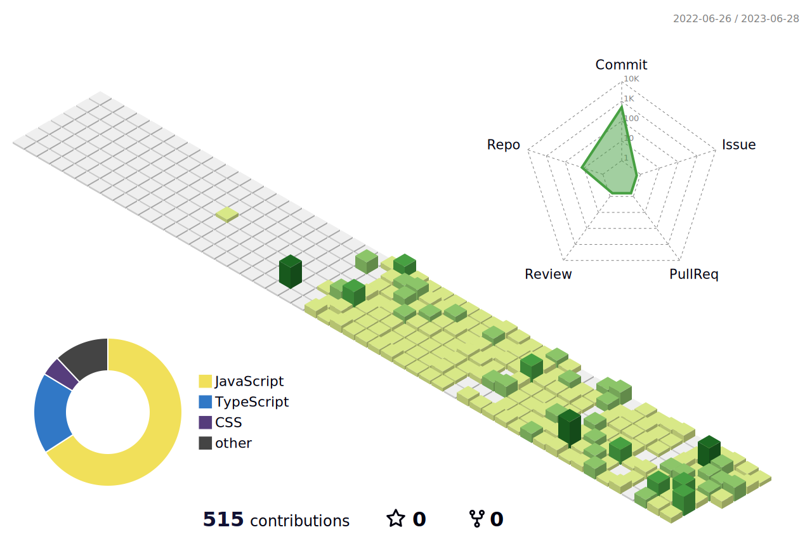

  Hi there 👋  I want to be a <b>developer</b> using JavaScript!
    

<b>블로그</b> 
  
   
  

  <h2>Learning!</h2>
  

      
    
     
    
    
     
    
     
    
     
  

   

  

<!--

**mintmin0320/mintmin0320** is a ✨ _special_ ✨ repository because its `README.md` (this file) appears on your GitHub profile.

Here are some ideas to get you started:

- 🔭 I’m currently working on ...
- 🌱 I’m currently learning ...
- 👯 I’m looking to collaborate on ...
- 🤔 I’m looking for help with ...
- 💬 Ask me about ...
- 📫 How to reach me: ...
- 😄 Pronouns: ...
- ⚡ Fun fact: ...
-->
